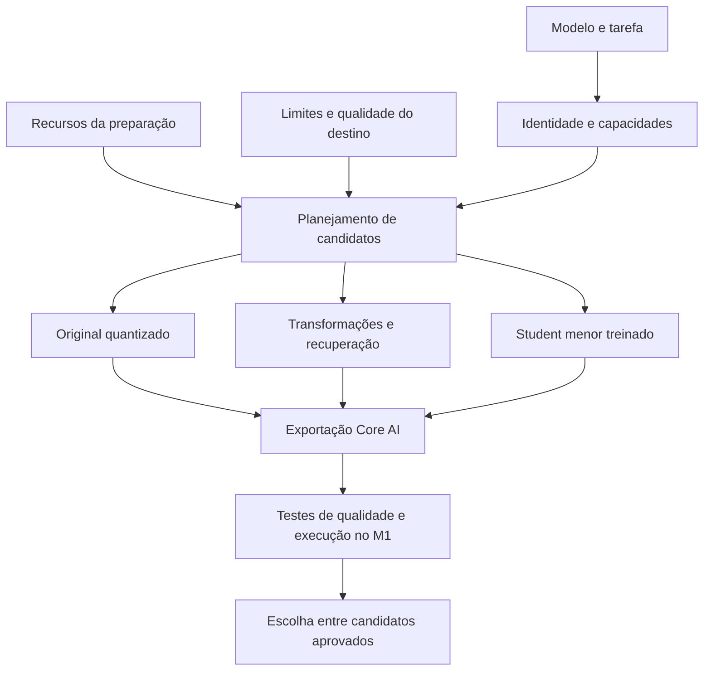

# Plano de compressão orientado ao dispositivo e à qualidade

8 de setembro de 2026. **Proposta de implementação e experimentos; não descreve capacidades já entregues.** Parte das medições de [recuperação](recovery-improvements.md) e da [auditoria inicial](pipeline-audit.md). Os resultados históricos continuam válidos dentro dos respectivos protocolos.

A direção recomendada é escolher a melhor representação executável do modelo dentro do orçamento do destino. Quantização, poda e destilação passam a ser alternativas combináveis. Uma execução pode terminar corretamente sem poda ou sem treinamento, desde que essa receita esteja explícita e cumpra os requisitos. A ferramenta deve reprovar um alvo inviável, preservar o diagnóstico e apresentar alternativas medidas.

## 1. O que a evidência atual permite afirmar

| Evidência local | Consequência para o planejamento |
| --- | --- |
| O treino modifica pesos e recupera parte da perplexidade perdida. | Há destilação real. Sua existência não demonstra qualidade suficiente. |
| No ensaio v6, o student int8 tem 123,23 MiB e PPL nativa 21,21258; o original int8 tem 136,67 MiB e PPL 19,79656. | Economizar 9,84% no arquivo com PPL 7,15% pior é uma troca modesta. Não foi demonstrado ganho de latência ou RAM residente. |
| Repetições e erros factuais aparecem também no checkpoint PyTorch. | Corrigir somente o exportador não resolve o comportamento. O SmolLM2-135M base também é uma referência inadequada para prometer boa conversa em português. |
| A receita int4 do student v6 aumentou a PPL de validação em 58,39% e foi recusada. | Essa receita falhou nesse checkpoint; isso não condena toda quantização em 4 bits. |
| O Qwen3-1.7B teve apenas metadados e orçamento analisados. | Ainda não há ensaio completo desse modelo nem validação de compressão de bilhões de parâmetros. |
| Foram registrados 617 testes de regressão aprovados em 7/9. | É evidência sobre o código, separada de capacidade linguística e desempenho no destino. |
| A execução nativa foi validada pela ponte Swift com GPU e `expectFrequentReshapes`; o caminho Python apresentou falha no compilador ANE. | A integração Swift funciona no SDK ensaiado. Não foi corrigido o compilador da Apple nem demonstrada execução exclusiva no ANE. |

Os recortes de avaliação são pequenos: a recuperação usou 4.730 transições no protocolo histórico; a comparação nativa acima, 1.549. São protocolos diferentes. Além disso, os resultados de teste foram consultados ao longo de várias tentativas v2–v6. Embora não tenham alimentado diretamente os gradientes, já influenciaram decisões de desenvolvimento. A avaliação final da nova estratégia precisa de um conjunto ainda não usado nessa seleção.

Não há evidência para garantir preservação de todas as capacidades de qualquer modelo sob qualquer taxa de compressão. Também não há prova de que os danos observados sejam irreversíveis. O objetivo implementável é ampliar as famílias suportadas, testar estratégias adequadas a cada uma e medir explicitamente o que foi preservado.

## 2. Separar preparação e execução

Hoje `budget.py` e `pipeline.make_plan()` concentram decisões em torno da máquina local e do treino completo. O novo plano terá dois perfis independentes:

- **Preparação:** RAM e disco disponíveis, dispositivos de cálculo, tempo máximo, volume de dados, candidatos e modos de treinamento permitidos.
- **Destino:** família do dispositivo, sistema/SDK mínimo, limite de memória residente, contexto, concorrência, latência e critérios de qualidade. Para o primeiro perfil: M1 Air, 8 GiB de memória total e uma sessão de conversa.

`target_params` continua disponível como restrição opcional. Reduzir bits preservando todos os parâmetros pode ser a melhor resposta ao objetivo de memória. Se o usuário exigir um teto de parâmetros, a ferramenta não poderá declarar que apenas quantizar cumpriu esse teto. `effort` deve controlar o trabalho de busca e recuperação; a agressividade deve ser expressa pelas restrições e pela perda tolerada, sem prometer qualidade por nome de preset.

### Orçamento concreto deste M1

Foram verificados 8.589.934.592 bytes de RAM e aproximadamente 16 GiB livres no volume durante esta revisão. O espaço muda com outras aplicações e precisa ser medido novamente antes de executar experimentos. Não iniciar uma varredura que reserve mais disco do que existe, nem apagar pesos ou checkpoints automaticamente para fazê-la caber.

Estimativa mínima de armazenamento dos pesos em 4 bits, em GB decimais:

| Parâmetros únicos | Somente pesos a 4 bits |
| ---: | ---: |
| 1,72 bilhão | 0,86 GB |
| 3 bilhões | 1,50 GB |
| 7 bilhões | 3,50 GB |
| 14 bilhões | 7,00 GB |
| 70 bilhões | 35,00 GB |

Esses números excluem escalas, tabelas, alinhamento, camadas preservadas em maior precisão, ativações, caches e especialização. Portanto, não demonstram que um 7B cabe confortavelmente no Air. A reserva atual do programa é de 4 GiB nesse computador; deve ser tratada como política inicial, complementada por medições de pressão de memória e pico real.

O AdamW FP32 atual exige aproximadamente `16 × parâmetros` bytes apenas para pesos, gradientes e dois momentos. Para os 1.720.574.976 parâmetros únicos sondados no Qwen, são cerca de **27,5 GB**, antes de ativações. Batch 1 e gradient checkpointing não eliminam esse custo estático. Trocar o otimizador pode reduzir momentos, mas não torna os demais custos inexistentes.

O cache de destilação atual custa `8 × (K + N) + 4` bytes por posição, fora tokens e serialização. Com K=192 e N=256: 3.588 bytes por posição, aproximadamente 3,59 GB por milhão ou 359 GB por 100 milhões. O planejamento precisa orçar esse armazenamento antes de prometer mais dados.

## 3. Diagnosticar e corrigir repetições e erros factuais

### Contrato de entrada e geração

`runtime_check.py` usa texto cru, sem template de conversa, e geração greedy. Esse protocolo é útil para verificar paridade numérica. A avaliação de uma interface de conversa precisa, adicionalmente, aplicar o template oficial, tokens especiais, modo de raciocínio, política de término e amostragem compatíveis com o checkpoint.

No Qwen3-1.7B, a própria documentação recomenda evitar greedy no modo thinking por risco de degradação e repetição. O experimento começará com modo non-thinking explicitamente registrado e avaliará thinking separadamente, com orçamento de geração suficiente. As configurações serão iguais entre referência e candidato. A recomendação específica desse modelo não será aplicada a todas as famílias. [Contrato de geração do Qwen3](https://huggingface.co/Qwen/Qwen3-1.7B#best-practices).

Manter dois protocolos: paridade determinística de logits/cache e qualidade de respostas com amostragem e sementes fixadas. Registrar respostas completas, término por EOS ou por limite, contexto realmente consumido e configurações. Penalidades de repetição poderão ser avaliadas como escolhas explícitas de decodificação; um candidato não será aprovado apenas por esconder seus loops com uma penalidade maior que a da referência.

Testar também conversas em vários turnos, padding, posições após prefill em blocos, reset entre sessões, fronteiras de contexto e máscaras. O token usado como padding pode coincidir com EOS: mascarar todas as ocorrências desse ID destruiria a supervisão legítima de término. Não alterar o comportamento de contexto silenciosamente.

### Dados e objetivo de recuperação

O corpus persistido atual preserva documentos de texto e separações verificáveis. A próxima representação precisa preservar mensagens, papéis, limites de respostas e máscaras de perda. Hoje o treino passa `labels=ids` e uma máscara de padding; não há seleção independente dos tokens de resposta do assistente.

Para recuperação de conversa, propor uma mistura explícita de texto geral, português, instruções e tarefas do domínio. Usar perda supervisionada nos tokens de resposta e EOS verdadeiro, combinada com KD quando adequado. Manter dados gerais para medir e limitar esquecimento. Conversas de uma mesma origem devem permanecer no mesmo split; acrescentar identificação de quase duplicatas, além da igualdade exata já existente.

Respostas do teacher não são automaticamente fatos corretos. Filtrar exemplos sintéticos com verificadores quando houver resposta objetiva, execução de código quando essa for a tarefa e fontes verificáveis para fatos. Separar cobertura e veracidade: copiar a distribuição do teacher também pode copiar seus erros. Treinamento supervisionado com alvos melhores pode superar o teacher em tarefas específicas; isso deve aparecer no teste, sem inferência de melhora universal.

Depois de uma referência estável, experimentar recuperação sobre trajetórias produzidas pelo próprio student: recolher contextos onde ele entra em loop ou erra e obter supervisão do teacher nesses contextos. Isso aborda a diferença entre aprender em prefixos corretos e gerar a própria continuação. Exige comparar generalização e custo, sem treinar nas perguntas do teste. [On-policy distillation](https://arxiv.org/abs/2306.13649).

### Avaliação necessária

| Dimensão | Como medir |
| --- | --- |
| Preservação da distribuição | PPL em documentos reservados e comparáveis; KL/logits em prefixos idênticos; métricas separadas por idioma e domínio. |
| Repetição | Taxa de respostas com ciclos, maior sequência repetida, repetição de n-gramas e término; distinguir listas/citações legítimas de degeneração. |
| Factualidade | Questões com referências e respostas verificáveis, variantes de formulação e testes de abstenção. Concordância com o teacher é uma medida diferente. |
| Instruções | Restrições verificáveis de formato/conteúdo, conversas em vários turnos e casos em português. [IFEval](https://arxiv.org/abs/2311.07911) fornece uma referência metodológica. |
| Erros plausíveis | Incluir concepções falsas frequentes e avaliar correção, sem tratar escala do modelo como garantia. [TruthfulQA](https://arxiv.org/abs/2109.07958). |
| Uso real | Pequeno conjunto de respostas avaliadas às cegas; testes executáveis para código; tarefas representativas do produto. |

Reportar tamanhos de amostra e incerteza. Um conjunto minúsculo não sustenta uma conclusão de diferença de dois pontos percentuais. Comparar cinco estados: original em ponto flutuante, original apenas quantizado, modelo estruturalmente reduzido, recuperado e exportado nativo. Usar a mesma precisão de referência nas comparações que isolam uma mudança; o ensaio histórico BF16 versus FP32 não deve ser reutilizado como ablação controlada.

## 4. Estratégias, em ordem de investimento

### A. Quantização por blocos e precisão por camada

Primeira prioridade: converter o modelo original e explorar quantização dos pesos, mantendo inicialmente ativações e cache em precisão já validada. O SDK instalado possui `QuantizerConfig.presets.w8()`, `w4()` e `w4_per_block(block_size=32)`. O preset global simples não é AWQ nem GPTQ.

Comparar grupos compatíveis com as dimensões, esquemas de escala e clipping. Medir quais projeções, embeddings e cabeça de saída são sensíveis antes de preservar seletivamente 8 ou 16 bits. Conferir pesos compartilhados e contabilizar parâmetros únicos. Conferir também tensores efetivamente comprimidos: dimensões incompatíveis podem deixar camadas sem compressão.

A escolha será pelo erro causado e pelo custo adicional em bytes/latência de preservar cada módulo. Uma aproximação de alocação de orçamento por camada pode reduzir candidatos; a validação global continua necessária porque os efeitos interagem. Tamanho de grupo menor melhora flexibilidade, mas aumenta escalas: uma escala FP16 por bloco de 16 pesos adiciona um bit por peso, antes de outros metadados.

Usar o roteiro oficial de exploração como ponto de partida para receitas e inspeção de cobertura. Sua avaliação preliminar com poucas entradas não substitui os testes de linguagem e execução nativa deste plano. [Exploração de compressão da Apple](https://github.com/apple/coreai-models/blob/main/skills/skills/model-compression-exploration/SKILL.md).

### B. Calibração sensível às ativações e reconstrução dos pesos quantizados

Implementar primeiro transformações compatíveis com o exportador: escalas dobradas nas operações adjacentes, clipping calibrado e reconstrução por bloco. AWQ orienta a proteção de pesos relevantes pelas ativações; GPTQ usa informação aproximada de segunda ordem para compensar erro de quantização. Os artigos fundamentam candidatos, sem demonstrar desempenho desses algoritmos no nosso M1. [AWQ](https://arxiv.org/abs/2306.00978), [GPTQ](https://arxiv.org/abs/2210.17323).

Verificar equivalência da transformação antes de quantizar, inclusive RMSNorm, residuais, Q/K normalization e pesos compartilhados. Nem toda reescala pode atravessar uma operação não linear. Para métodos de segunda ordem, limitar o tamanho das matrizes auxiliares, usar regularização numérica e registrar erro de reconstrução em dados reservados. Uma matriz Hessiana d×d também pode exceder a RAM disponível.

Separar cálculo de pesos/escalas do empacotamento. Converter para o formato suportado pelo Core AI e comparar os valores dequantizados; um checkpoint de outro runtime não se torna compatível apenas pela extensão. A exportação não poderá quantizar novamente sem medir esse erro adicional.

Uma extensão é redistribuir outliers com rotações, como no SpinQuant, para facilitar quantização. Distinguir transformações que podem ser incorporadas aos pesos daquelas que exigem operações durante inferência. Rotações aprendidas têm custo de otimização; operações Hadamard não incorporáveis exigem execução eficiente e exportação compatível. A implementação de referência usa dependências CUDA, portanto não é uma solução pronta para MPS/Core AI. [SpinQuant](https://github.com/facebookresearch/SpinQuant).

### C. Paletização e representações com tabelas

Experimentar paletização de 4, 6 e 8 bits, granularidades e escala por canal. O pacote instalado contém `KMeansPalettizer`. Contabilizar índices, tabelas e módulos preservados; medir o custo de acesso/descompactação no destino. Seis bits de armazenamento não significam uma unidade de cálculo de seis bits mais rápida.

Quantização vetorial ou aditiva é uma extensão posterior: AQLM, por exemplo, aprende representações por códigos e sua reconstrução. Ela pode oferecer uma troca melhor em poucos bits, mas exige verificar representação e kernels de execução. Descompactar todos os pesos para FP16 no carregamento perde a economia de memória residente. [AQLM](https://arxiv.org/abs/2401.06118).

### D. Recuperação com poucos parâmetros treináveis

Substituir a exigência de AdamW sobre todos os pesos por opções de LoRA, base quantizada congelada, ajuste seletivo de projeções/normalizações e recuperação local de blocos. O orçamento passa a separar pesos congelados, parâmetros treináveis, gradientes, momentos e ativações. LoRA reduz o custo de treinamento; por si só, não reduz o número de parâmetros do modelo base.

MLX LM oferece treinamento LoRA/QLoRA no ecossistema Apple Silicon e merece um backend de preparação opcional. A lista de famílias e a operação usada precisam ser verificadas no código instalado. Não assumir que bibliotecas dependentes de kernels CUDA funcionam em MPS. [Treinamento e fusão no MLX LM](https://github.com/ml-explore/mlx-lm/blob/main/mlx_lm/LORA.md).

Não misturar representações de treinamento e implantação: uma base quantizada para treinar adaptadores não é automaticamente o empacotamento int4 do Core AI. Fundir os deltas por camada, requantizar de maneira controlada e medir paridade após fusão e exportação. Se a fusão precisar materializar uma cópia completa FP32, o caminho continua inadequado para o Air. Se forem mantidas projeções extras no runtime, elas entram no orçamento.

Comparar inicialmente ranks pequenos e módulos selecionados, ampliando-os somente quando houver ganho em validação. Usar checkpointing e perda em blocos de tokens/vocabulário para evitar logits completos enormes, preservando a normalização matemática. Cache top-k reduz armazenamento do teacher; não elimina sozinho o tensor completo de logits do student.

### E. Processamento sequencial para preparar modelos maiores que a RAM

Carregar pesos por shard/camada, coletar ativações representativas em lotes limitados, comprimir ou reconstruir um bloco e gravar seu resultado antes de avançar. Planejar também buffers das ativações, embeddings e cabeça de saída. O pico não é apenas o tamanho da maior camada.

Teacher e student não precisam residir simultaneamente. O projeto já os usa em etapas distintas; falta evitar o carregamento integral dentro dessas etapas. Targets podem ser produzidos em lotes e consumidos por rodadas com cotas de disco, identidade e remoção explicitamente configurada. Avaliar formatos menores e amostragem da cauda com análise de viés/variância, sem voltar a normalizar apenas top-k.

O mecanismo não deve prometer treinamento integral com backward através de todas as camadas só porque o forward foi paginado. Recuperação local, blocos congelados e adaptação seletiva têm contratos diferentes. Treino completo com offload pode exigir transferências proibitivas.

Streaming durante preparação pode ser uma boa troca de tempo por RAM. Recarregar vários gigabytes de pesos do SSD a cada token de inferência pode inviabilizar conversa. Esse segundo uso será experimental, com limite de latência e tráfego de disco medido.

### F. Redução estrutural e destilação entre arquiteturas

Depois das referências quantizadas, comparar cortes graduais de largura, grupos de atenção e profundidade sob o mesmo orçamento. Substituir a prioridade fixa de MLP por ablações de perda e tempo no dispositivo, preservando dependências entre Q/K/V, RoPE, residuais, configurações por camada e caches. Recuperar e reavaliar entre cortes; rejeitar candidatos dominados por alternativas menores nativas.

Minitron demonstra a combinação de poda e destilação, mas seus resultados não estabelecem que poucas centenas de milhares de tokens recuperem qualquer corte. O orçamento de dados deve crescer em resposta às curvas de aprendizado e à capacidade disponível, sem confundir repetição do mesmo corpus com cobertura nova. [Minitron](https://arxiv.org/abs/2407.14679).

Duas extensões merecem experimentos próprios:

- **Redução da dimensão residual:** transformações e cortes de linhas/colunas no estilo SliceGPT, respeitando as hipóteses de equivalência da arquitetura. Afeta o grafo inteiro e precisa de adaptador de exportação, não apenas edição do config. [SliceGPT](https://arxiv.org/abs/2401.15024).
- **Fatoração de matrizes:** substituir W de dimensão m×n por dois fatores com rank r quando `r(m+n) < mn`. Selecionar rank com ativações e reconstrução, não apenas truncar SVD dos pesos. Contar quantização de ambos os fatores e medir duas multiplicações: menos parâmetros pode resultar em maior latência. [SVD-LLM](https://arxiv.org/abs/2403.07378).

Rota adicional: usar um student menor já pré-treinado, com recuperação orientada às tarefas do teacher. O modo atual de student externo exige identidade de tokenizer para KD por logits. Com tokenizers diferentes, começar por destilação de respostas e perda supervisionada no tokenizer do student; KL entre índices incompatíveis continua inválida. O manifesto deve declarar a troca de arquitetura e sua proveniência.

### G. Memória e operações do runtime

Para atenção convencional, o cache KV tem custo aproximado `2 × camadas × batch × contexto × cabeças_KV × dimensão_cabeça × bytes_por_elemento`. Quantizar pesos não reduz esse cache. Arquiteturas com estados recorrentes, atenção latente ou caches heterogêneos exigem outras fórmulas.

Manter cache persistente, prefill em blocos e buffers reutilizáveis. A ponte Swift atual já preserva estados, mas também materializa logits em arrays e os grava em arquivo por chamada. Isso é um mecanismo de validação. O caminho de geração do produto deve selecionar/amostrar o próximo token sem transportar todo o vocabulário pelo disco, mantendo acesso a logits completos no modo de diagnóstico.

Preservar o compartilhamento de cabeças KV que o modelo já possui. Converter uma arquitetura para GQA/MQA pode reduzir o cache, mas altera projeções e distribuição de atenção: exige um experimento de transformação e recuperação, não apenas trocar um campo de configuração.

Estudar cache quantizado com escalas apropriadas para K e V, medindo contextos longos e acumulação de erro. KIVI é uma referência para assimetria entre essas distribuições; não é prova de disponibilidade do seu kernel no Core AI. [KIVI](https://arxiv.org/abs/2402.02750). Cache paginado ajuda a gerenciar alocações e múltiplas sessões; em batch 1 não reduz magicamente o conteúdo necessário. Janela deslizante reduz contexto efetivo e deve ser declarada como alteração de capacidade quando o modelo não a possui originalmente.

Preservar atenção eficiente e operações fundidas no export. Implementar Metal personalizado somente depois de um perfil identificar gargalo e de confirmar suporte no M1. TensorOps pode usar aceleração disponível em cada geração; aceleradores introduzidos na família M5 não estão fisicamente presentes no M1. [Metal e TensorOps](https://developer.apple.com/videos/play/wwdc2026/330/).

### H. Opções úteis, com objetivos distintos

Retrieval com fontes e calculadoras/verificadores pode melhorar a factualidade do sistema. Exige contabilizar índice, modelo de embeddings, memória e integração; não demonstra retenção dos fatos nos pesos comprimidos. Deve ser uma capacidade opcional declarada do aplicativo.

Decodificação especulativa pode melhorar latência, mas pode aumentar memória pelo modelo auxiliar; preservar a distribuição requer o protocolo correto de aceitação. Esparsidade não estruturada só traz economia de execução se formato e kernels explorarem os zeros no M1. Zerar pesos de uma matriz densa não basta. Compressão de arquivo sem perda reduz distribuição em disco/rede, mas não a memória dos tensores já descompactados. Compartilhamento real de pesos e eliminação de constantes duplicadas são otimizações legítimas, com benefício limitado pelo grafo.

## 5. O significado implementável de “qualquer modelo”

Criar uma interface comum com adaptadores por tarefa e arquitetura. Cada adaptador declara carregamento, pré/pós-processamento, entradas e saídas, módulos comprimíveis, estados, transformações permitidas, métricas e conversão. Descobrir um `nn.Linear` não basta para saber se é seguro remover canais ou como julgar a tarefa.

| Família/tarefa | Extensão necessária |
| --- | --- |
| Decoder causal denso | Primeira cobertura real: template, atenção/cache, quantização, recuperação e exportação por família. |
| MoE | Contar pesos residentes e ativos separadamente; medir uso dos experts; avaliar poda/fusão e recuperar roteador. Poucos parâmetros ativos não significam poucos parâmetros armazenados. |
| SSM, híbridos e atenção latente | Adaptadores de estados e operações próprios; não aplicar cirurgia de atenção convencional por semelhança de nomes. |
| Encoder, embeddings e classificação | Preservar pooling/normalização e avaliar similaridade, recuperação ou classificação; uma cabeça causal aleatória não cria um gerador treinado. |
| Encoder-decoder, visão, áudio e multimodal | Preservar caminhos da tarefa, projetores e estados; usar métricas apropriadas, como acurácia, IoU ou erro de transcrição. Extrair apenas texto é uma mudança de finalidade explícita. |
| Difusão e outros geradores | Calibração em passos e condições representativos; preservar scheduler/contratos e qualidade perceptual da tarefa. Reduzir passos exige estratégia específica e validação adicional. |

O preflight deve distinguir: modelo identificável, carregável, comprimível por determinada receita, convertível com os operadores disponíveis e executável no destino. Operações ausentes exigem implementação/lowering e validação. Nenhuma dessas categorias implica automaticamente as seguintes.

Começar ampliando cobertura real em famílias selecionadas e publicar a matriz de suporte com casos medidos. Um modelo desconhecido recebe diagnóstico do contrato ausente e opções aplicáveis. Não retornar um `.aimodel` “aprovado” com modalidades, pesos ou operadores descartados silenciosamente.

## 6. Arquitetura da CLI e integridade das etapas

Fluxo proposto:

Evoluir `pipeline.py` para etapas reutilizáveis de um grafo de receitas. Implementar contratos pequenos antes de dividir o arquivo inteiro: perfil do destino, capacidade do adaptador, resultado do candidato e relatório de aceitação. Os nomes de módulos abaixo são uma proposta de responsabilidade, não interfaces já disponíveis.

| Responsabilidade | Ponto de partida/novo módulo proposto |
| --- | --- |
| Memória de preparação e destino, custo por regime | `budget.py`, `probe.py`, futuro `target.py` |
| Receitas concorrentes em qualidade, execução sequencial sob RAM limitada | `pipeline.py`, `effort.py`, futuro `planner.py` |
| Capacidades por arquitetura e tarefa | `arch.py`, `loading.py`, futuro `adapters/` |
| Mensagens, máscaras e dados reservados | `calibration.py`, `corpus.py`, `inputs.py` |
| Adaptadores, recuperação por bloco e cache com cota | `distill/train.py`, `distill/teacher.py`, `distill/loss.py`, futuros backends de preparação |
| Quantização calibrada e inspeção de cobertura | `export.py`, `local_export.py`, futuro `compression/` |
| Avaliação de tarefa e seleção sob orçamento | `verify.py`, `runtime_check.py`, futuro `evaluation/` |
| Geração residente e medição nativa | `runtime_bridge.swift`, `swift_runtime.py` |
| Retomada e proveniência | `state.py`, fingerprints de `pipeline.py` |

Preservar as correções já feitas: pesos/revisões verificáveis, tokenizers semanticamente compatíveis, dados distintos, gradientes corretos, melhor checkpoint independente da paciência, estado RNG, atualização atômica e reprovação de falhas reais. Acrescentar versões de backend, template, configuração do destino e receita efetiva à identidade do candidato.

Completar autenticação dos repositórios restritos nos backends de download, mantendo revisão fixa, validação de conteúdo e retomada. Uma recusa de acesso não autoriza substituir o checkpoint por outra fonte. Conferir o pico transitório do carregamento, além do tamanho final do modelo, e encerrar cedo quando nem o menor lote couber na receita escolhida.

Retomada passa a alcançar blocos de calibração, transformações e empacotamento, além de download/treino. Cada resultado parcial precisa de checksum e commit atômico. Ao mudar um ingrediente, invalidar apenas dependentes. Falha numérica ou de compilação deve ficar registrada com causa e candidato; uma alternativa só conta como solução se cumprir os mesmos requisitos e passar nos próprios testes.

O pacote de implantação deve conter `.aimodel` verdadeiro e metadados suficientes para reproduzir a interface: tokenizer e/ou preprocessador, template, tokens especiais, contexto, formatos, precisão do cache e dependências de execução. Manter proveniência e relatório junto do artefato, sem misturar logs privados ou checkpoints intermediários na distribuição.

## 7. Sequência de implementação e critérios de avanço

Todas as metas abaixo são propostas, não resultados obtidos. Antes de executar uma fase, fixar suas tolerâncias, dados e recursos no manifesto. O pipeline não ajustará os critérios depois de ver o teste.

| Fase | Entrega concreta | Critério para avançar |
| --- | --- | --- |
| 0 — Referências e avaliação | Perfis separados, benchmark de tarefa, contrato de conversa, teste final reservado e estimativa de disco/RAM por etapa. | Reproduzir original e referência quantizada com entradas/precisões conhecidas; distinguir falha de modelo, receita e runtime. |
| 1 — Primeiro modelo de conversa completo | Qwen3-1.7B original convertido com uma receita conservadora; medir no M1. Sem exigir treino completo como pré-condição para exportar. | Geração com template e término corretos, paridade numérica/cache e orçamento medido. O teste pode reprovar o modelo para o uso pretendido. |
| 2 — Compressão dos pesos | W8, W4 por blocos, precisão por camada; depois escalas/clipping calibrados e paletização. | Encontrar candidato que preserve qualidade e ofereça redução útil medida; explicar tensores não comprimidos e custos de carregamento. |
| 3 — Recuperação viável | LoRA/base congelada, máscaras de resposta, streaming de preparação e cotas de cache; medir curva de dados versus qualidade. | Superar a alternativa somente quantizada ou habilitar um orçamento antes inviável, sem regressão inaceitável de tarefa. |
| 4 — Novas estruturas | Ablações de poda, ranks, student pré-treinado e adaptadores adicionais. | Ganhar de referências sob o mesmo orçamento; cada família deve ter teste real completo, além de testes sintéticos. |
| 5 — Preparação maior, destino pequeno | Executar preparação em máquina mais potente e validar pacote portátil no Air. | Evidência separada do custo de preparação e da qualidade/RAM/latência no M1, incluindo carregamento frio. |

Primeira matriz de experimentos: Qwen3-1.7B sem alteração estrutural, int8, int4 por blocos e int4 com camadas sensíveis preservadas. Usar uma versão menor pré-treinada, como Qwen3-0.6B após confirmar compatibilidade, como referência de tamanho/qualidade; repetir depois em outra família. Fixar revisões do Hub. Rodar candidatos sequencialmente neste Air; paralelizar modelos pesados competiria pela mesma memória unificada.

Separar seleção e teste final. Para a primeira exploração, é razoável propor no máximo 5% de aumento de PPL contra a referência equivalente como filtro inicial de quantização. Isso não substitui limites de factualidade, instruções, loops ou recursos. Resultados inconclusivos por amostra pequena devem permanecer inconclusivos. Não comparar PPL entre tokenizers diferentes: nesse caso, usar tarefas comparáveis e, se necessário, medidas normalizadas por texto como complemento.

Na seleção, excluir candidatos que excedem limites duros e destacar os que ninguém supera simultaneamente em qualidade, memória e latência. Não escolher automaticamente o primeiro arquivo que passa nem apenas o menor arquivo. Se só um modelo sem corte cumprir os limites, esse é um resultado legítimo para a receita de compressão de memória, sem declarar poda realizada.

Medir carregamento frio e quente, especialização, tempo até primeiro token, prefill, tokens/s sustentados, p50/p95 por comprimento e pico de memória. Começar com contextos 512, 2.048 e 4.096 dentro da capacidade do modelo; ampliar somente se couber. Observar pressão de memória, variação de swap e estabilidade térmica em uma sessão prolongada. Não somar RSS e métricas Metal indiscriminadamente em memória unificada nem atribuir swap global inteiramente ao processo.

## 8. Preparar no M5 Pro melhora o resultado usado no M1?

**Pode melhorar a qualidade do artefato produzido, se o trabalho adicional produzir pesos ou uma representação melhores dentro do mesmo orçamento do M1.** Mais RAM e cálculo permitem teachers maiores, mais dados distintos, calibração melhor, mais candidatos, recuperação mais longa e eventualmente treinamento sensível à quantização. O ganho depende da memória efetivamente disponível e da estratégia; o nome do chip, sozinho, não determina o que cabe.

Se os pesos, precisão e contrato de geração forem os mesmos, preparar ou converter em um chip mais novo não acrescenta conhecimento. Pequenas diferenças numéricas entre dispositivos podem alterar trajetórias, mas não justificam esperar uma melhora sistemática de factualidade. O Air continua com seus limites de RAM, largura de banda, operações e temperatura.

Distribuir o `.aimodel` compatível com o destino. Se usar compilação antecipada, produzir a variante `.aimodelc` da arquitetura do M1 e selecioná-la pela identificação do dispositivo. A documentação da Apple distingue compilação na máquina de build da especialização restante no destino; ela inclui Macs M1 entre os dispositivos suportados. Essa técnica reduz trabalho de inicialização, não treina o modelo. [Compilação antecipada do Core AI](https://developer.apple.com/documentation/coreai/compiling-core-ai-models-ahead-of-time).

O ambiente atual usa macOS 27 beta. Versões mínimas, formatos de cache e operadores devem constar no pacote; não presumir execução em sistemas anteriores. A compilação AOT histórica concluiu, mas o `.aimodelc` standalone ainda precisa de execução comprovada no M1: os ensaios de runtime existentes carregaram o `.aimodel` diretamente.

O ensaio decisivo será comparar no mesmo M1 dois candidatos com orçamento equivalente: um preparado com recursos locais e outro preparado na máquina maior. Só então será possível quantificar a melhora. A recomendação imediata é manter o M1 como dispositivo de validação obrigatória e permitir que a preparação utilize recursos adicionais sem mudar os requisitos do artefato final.
